# Bombay Silvers — Entity Relationship Diagram

## Mermaid ER Diagram

Paste into [mermaid.live](https://mermaid.live) or any Mermaid-compatible renderer.

```mermaid
erDiagram

  %% ── AUTHENTICATION & IDENTITY ────────────────────────────────────────────

  auth_users {
    uuid  id        PK
    text  email
    text  phone
  }

  users {
    uuid        id         PK  "→ auth.users"
    text        email
    text        phone
    text        full_name
    user_role   role
    boolean     is_active
    timestamptz last_sign_in
    timestamptz created_at
    timestamptz updated_at
    timestamptz deleted_at
  }

  sessions {
    uuid        id          PK
    uuid        user_id     FK
    text        device_name
    text        device_type
    inet        ip_address
    text        user_agent
    boolean     is_trusted
    timestamptz last_active_at
    timestamptz expires_at
    timestamptz revoked_at
    timestamptz created_at
  }

  %% ── DEALER PROFILE ────────────────────────────────────────────────────────

  firms {
    uuid         id                  PK
    text         firm_name
    text         proprietor_name
    business_type business_type
    smallint     years_in_business
    metal_focus  primary_metal_focus
    text         monthly_turnover_range
    text         city
    text         state
    text         gstin
    text         pan_number
    timestamptz  created_at
    timestamptz  updated_at
  }

  dealers {
    uuid           id              PK
    uuid           user_id         FK
    uuid           firm_id         FK
    text           dealer_code
    text           referral_code
    uuid           referred_by     FK  "self-ref → dealers"
    dealer_status  status
    dealer_tier    tier
    numeric        credit_limit
    numeric        current_balance
    timestamptz    created_at
    timestamptz    updated_at
    timestamptz    deleted_at
  }

  kyc_documents {
    uuid              id              PK
    uuid              dealer_id       FK
    kyc_document_type document_type
    text              file_url
    text              file_name
    kyc_status        status
    text              rejection_reason
    uuid              reviewed_by     FK  "→ users"
    timestamptz       reviewed_at
    timestamptz       created_at
    timestamptz       updated_at
  }

  %% ── PRODUCT CATALOGUE & INVENTORY ────────────────────────────────────────

  warehouses {
    uuid        id         PK
    text        name
    text        city
    text        state
    text        address
    text        pincode
    boolean     is_active
    timestamptz created_at
    timestamptz updated_at
  }

  products {
    uuid         id                PK
    text         sku
    text         name
    metal_type   metal_type
    numeric      purity
    numeric      unit_weight_grams
    product_unit unit
    text         hsn_code
    numeric      gst_rate
    boolean      is_active
    timestamptz  created_at
    timestamptz  updated_at
  }

  inventory {
    uuid        id                 PK
    uuid        product_id         FK
    uuid        warehouse_id       FK
    numeric     quantity_available
    numeric     quantity_reserved
    numeric     rate_per_gram
    timestamptz created_at
    timestamptz updated_at
  }

  inventory_transactions {
    uuid                         id               PK
    uuid                         inventory_id     FK
    inventory_transaction_type   transaction_type
    numeric                      quantity_delta
    numeric                      quantity_after
    numeric                      rate_per_gram
    text                         reason
    text                         reference_type
    uuid                         reference_id
    uuid                         performed_by     FK  "→ users"
    timestamptz                  created_at
  }

  %% ── ORDERS & FULFILMENT ───────────────────────────────────────────────────

  orders {
    uuid          id               PK
    text          order_number
    uuid          dealer_id        FK
    order_status  status
    text          delivery_address
    text          delivery_city
    text          delivery_state
    text          delivery_pincode
    numeric       subtotal
    numeric       total_gst
    numeric       grand_total
    text          notes
    text          cancelled_reason
    timestamptz   dispatched_at
    timestamptz   delivered_at
    uuid          created_by       FK  "→ users"
    timestamptz   created_at
    timestamptz   updated_at
    timestamptz   deleted_at
  }

  order_items {
    uuid    id           PK
    uuid    order_id     FK
    uuid    product_id   FK
    uuid    warehouse_id FK
    numeric quantity
    numeric unit_price
    numeric gst_rate
    numeric gst_amount
    numeric total_amount
    timestamptz created_at
  }

  %% ── FINANCE ───────────────────────────────────────────────────────────────

  invoices {
    uuid           id             PK
    text           invoice_number
    uuid           order_id       FK
    uuid           dealer_id      FK
    date           invoice_date
    date           due_date
    numeric        subtotal
    numeric        cgst
    numeric        sgst
    numeric        igst
    numeric        total_gst
    numeric        grand_total
    invoice_status status
    text           pdf_url
    timestamptz    created_at
    timestamptz    updated_at
  }

  ledger_entries {
    uuid                    id             PK
    uuid                    dealer_id      FK
    ledger_entry_type       entry_type
    numeric                 amount
    numeric                 balance_after
    text                    description
    ledger_reference_type   reference_type
    uuid                    reference_id
    uuid                    created_by     FK  "→ users"
    timestamptz             created_at
  }

  %% ── GROWTH & COMMS ────────────────────────────────────────────────────────

  referrals {
    uuid             id                 PK
    uuid             referrer_id        FK
    uuid             referred_dealer_id FK  "nullable"
    text             referred_name
    text             referred_phone
    referral_status  status
    numeric          commission_rate
    numeric          commission_amount
    timestamptz      commission_paid_at
    timestamptz      created_at
    timestamptz      updated_at
  }

  notifications {
    uuid              id         PK
    uuid              user_id    FK
    text              title
    text              body
    notification_type type
    boolean           is_read
    timestamptz       read_at
    jsonb             metadata
    timestamptz       created_at
  }

  %% ── AUDIT ─────────────────────────────────────────────────────────────────

  audit_logs {
    uuid         id          PK
    uuid         user_id     FK  "nullable"
    audit_action action
    text         entity_type
    uuid         entity_id
    jsonb        old_values
    jsonb        new_values
    inet         ip_address
    text         user_agent
    jsonb        metadata
    timestamptz  created_at
  }

  %% ── RELATIONSHIPS ─────────────────────────────────────────────────────────

  auth_users        ||--|| users                  : "extends"
  users             ||--o| dealers                : "is a"
  users             ||--o{ sessions               : "has"
  users             ||--o{ notifications          : "receives"
  users             ||--o{ audit_logs             : "creates"

  dealers           ||--o| firms                  : "registered as"
  dealers           ||--o{ kyc_documents          : "submits"
  dealers           }o--o| dealers                : "referred by"
  dealers           ||--o{ orders                 : "places"
  dealers           ||--o{ invoices               : "billed via"
  dealers           ||--o{ ledger_entries         : "has"
  dealers           ||--o{ referrals              : "refers"
  dealers           }o--o| referrals              : "referred through"

  products          ||--o{ inventory              : "stocked at"
  warehouses        ||--o{ inventory              : "holds"
  inventory         ||--o{ inventory_transactions : "tracked by"

  orders            ||--o{ order_items            : "contains"
  orders            ||--o| invoices               : "invoiced as"
  order_items       }o--|| products               : "is"
  order_items       }o--|| warehouses             : "sourced from"
```



---

## Table Summary

| Table | Rows represent | Soft delete? | Immutable? |
|---|---|---|---|
| `users` | Every authenticated person | ✅ `deleted_at` | — |
| `firms` | Dealer's registered business | — | — |
| `dealers` | Dealer-specific profile & financials | ✅ `deleted_at` | — |
| `kyc_documents` | One document per type per dealer | — | — |
| `warehouses` | Physical storage locations | — (use `is_active`) | — |
| `products` | Tradeable bullion SKUs | — (use `is_active`) | — |
| `inventory` | Stock level per product per warehouse | — | — |
| `inventory_transactions` | Every stock movement | — | ✅ Append-only |
| `orders` | Purchase orders by dealers | ✅ `deleted_at` | — |
| `order_items` | Line items within an order | — | ✅ Post-confirm |
| `invoices` | GST invoice per order | — | — |
| `ledger_entries` | Financial debit/credit events | — | ✅ Append-only |
| `referrals` | Dealer invite tracking | — | — |
| `notifications` | In-app alerts per user | — | — |
| `sessions` | Device sessions (revokable) | — (`revoked_at`) | — |
| `audit_logs` | System-wide action log | — | ✅ Append-only |

---

## Key Cardinalities

```
auth.users ──────── 1:1 ──────── users
users ────────────  1:0..1 ───── dealers
dealers ──────────  1:0..1 ───── firms
dealers ──────────  1:N ──────── kyc_documents
dealers ──────────  1:N ──────── orders ──── N:N (via order_items) ──── products
                                           └── warehouses
orders ───────────  1:1 ──────── invoices
dealers ──────────  1:N ──────── ledger_entries
dealers ──────────  1:N ──────── referrals (as referrer)
dealers ──────────  0..1:N ───── referrals (as referred)
products ─────────  1:N ──────── inventory ──── 1:N ──── inventory_transactions
warehouses ───────  1:N ──────── inventory
users ────────────  1:N ──────── notifications
users ────────────  1:N ──────── sessions
users ────────────  1:N ──────── audit_logs
```
